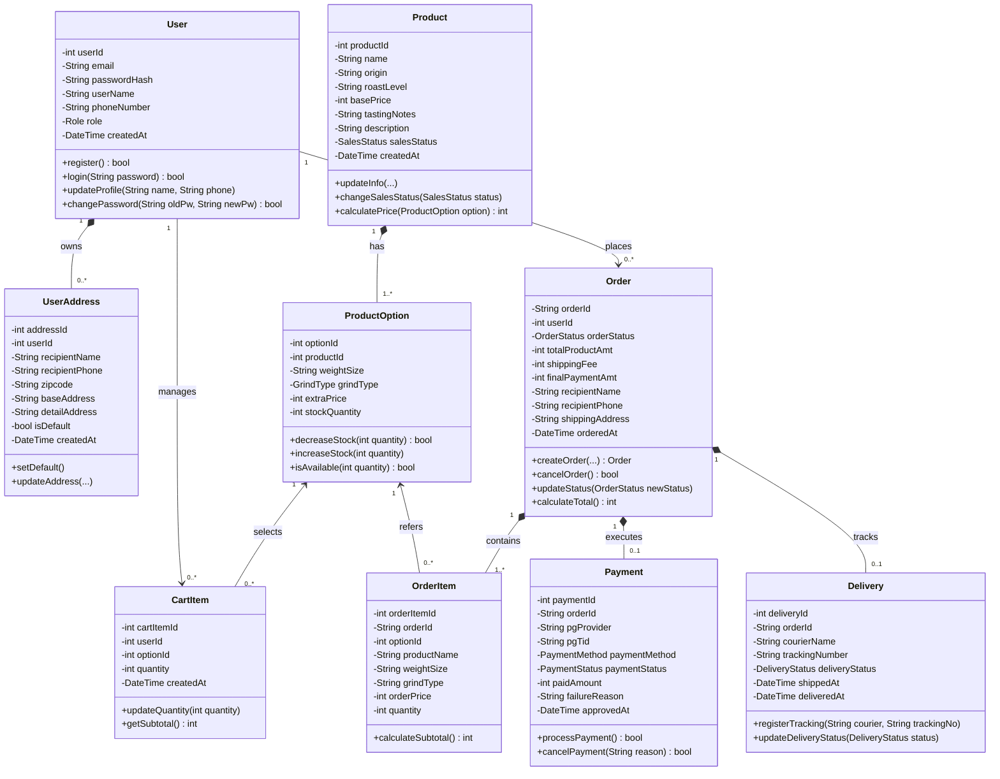

# 4.1 Class Diagram & Specification

## 1. Overview

This document specifies the UML Class Diagram and class-level design for the back-end system of the **Coffee Bean Shopping Mall System** (`<Coffee Bean Mall Shopping System>`), addressing SRS Section 4.1.

The domain architecture directly maps to the relational schema defined in [backend/schema.sql](file:///Users/seungwonlee/Documents/GitHub/coffee-shop/backend/schema.sql) and the user interactions defined in the front-end use case diagram [docs/frontend/usecase-diagram.drawio.svg](file:///Users/seungwonlee/Documents/GitHub/coffee-shop/docs/frontend/usecase-diagram.drawio.svg).

Interactive diagram source: [class-diagram.drawio.svg](file:///Users/seungwonlee/Documents/GitHub/coffee-shop/docs/backend/class-diagram.drawio.svg)

---

## 2. Class Specifications

### 2.1 User & Account Management
#### `User`
- **Description**: Represents an account in the shopping mall system (Customer, Member, Administrator).
- **Attributes**:
  - `userId: int`: Primary identifier.
  - `email: String`: Unique user login email.
  - `passwordHash: String`: Securely hashed password.
  - `userName: String`: Display name of the user.
  - `phoneNumber: String`: Contact phone number.
  - `role: Role`: User privilege (`MEMBER`, `ADMIN`).
  - `createdAt: DateTime`: Account registration timestamp.
- **Methods**:
  - `register()`: Registers a new user account.
  - `login(password: String): bool`: Authenticates user credentials.
  - `updateProfile(name: String, phone: String)`: Updates user profile data.
  - `changePassword(oldPw: String, newPw: String): bool`: Validates old password and sets new hash.

#### `UserAddress`
- **Description**: Delivery destination associated with a member.
- **Attributes**:
  - `addressId: int`: Identifier.
  - `userId: int`: Foreign key to `User`.
  - `recipientName: String`: Name of recipient.
  - `recipientPhone: String`: Phone number of recipient.
  - `zipcode: String`: Postal code.
  - `baseAddress: String`: Primary street/road address.
  - `detailAddress: String`: Apartment, suite, or unit details.
  - `isDefault: bool`: Flag indicating default delivery address.
  - `createdAt: DateTime`: Creation timestamp.
- **Methods**:
  - `setDefault()`: Marks this address as default and clears others for the user.
  - `updateAddress(...)`: Updates address attributes.

---

### 2.2 Product Catalog & Inventory
#### `Product`
- **Description**: Master coffee bean entity.
- **Attributes**:
  - `productId: int`: Primary identifier.
  - `name: String`: Name of the coffee bean (e.g., "Ethiopia Yirgacheffe G1").
  - `origin: String`: Country/region of origin.
  - `roastLevel: String`: Roasting profile (Light, Medium, Dark).
  - `basePrice: int`: Base unit price in KRW.
  - `tastingNotes: String`: Flavor profiles (e.g., Floral, Citrus, Jasmine).
  - `description: String`: Detailed product narrative.
  - `salesStatus: SalesStatus`: `ON_SALE`, `SOLD_OUT`, or `STOPPED`.
  - `createdAt: DateTime`: Registration timestamp.
- **Methods**:
  - `updateInfo(...)`: Modifies master product details.
  - `changeSalesStatus(status: SalesStatus)`: Changes sales availability.
  - `calculatePrice(option: ProductOption): int`: Computes `basePrice + extraPrice`.

#### `ProductOption`
- **Description**: Specific sellable variant with inventory (weight size, grind type).
- **Attributes**:
  - `optionId: int`: Identifier.
  - `productId: int`: Foreign key to `Product`.
  - `weightSize: String`: Package volume (`200g`, `500g`, `1kg`).
  - `grindType: GrindType`: Grind setting (`WHOLE_BEAN`, `HAND_DRIP`, `ESPRESSO`).
  - `extraPrice: int`: Additional price surcharge for this option.
  - `stockQuantity: int`: Current remaining units in inventory.
- **Methods**:
  - `decreaseStock(quantity: int): bool`: Atomically decrements stock if sufficient.
  - `increaseStock(quantity: int)`: Replenishes inventory.
  - `isAvailable(quantity: int): bool`: Checks if requested quantity is in stock.

---

### 2.3 Shopping Cart
#### `CartItem`
- **Description**: Temporary item staged by a user prior to order placement.
- **Attributes**:
  - `cartItemId: int`: Identifier.
  - `userId: int`: Owner user.
  - `optionId: int`: Target product option.
  - `quantity: int`: Requested quantity.
  - `createdAt: DateTime`: Added timestamp.
- **Methods**:
  - `updateQuantity(quantity: int)`: Sets new order volume.
  - `getSubtotal(): int`: Computes `(basePrice + extraPrice) * quantity`.

---

### 2.4 Orders & Fulfillment
#### `Order`
- **Description**: Purchase transaction aggregate root.
- **Attributes**:
  - `orderId: String`: Unique business ID (e.g., `ORD-2026-X`).
  - `userId: int`: Customer placing order.
  - `orderStatus: OrderStatus`: `PENDING`, `PAID`, `PREPARING`, `SHIPPED`, `DELIVERED`, `CANCEL_REQUESTED`, `CANCELLED`.
  - `totalProductAmt: int`: Total item charges.
  - `shippingFee: int`: Applied delivery fee.
  - `finalPaymentAmt: int`: Net billed amount.
  - `recipientName: String`, `recipientPhone: String`, `shippingAddress: String`: Delivery snapshot.
  - `orderedAt: DateTime`: Timestamp of placement.
- **Methods**:
  - `createOrder(...)`: Factory method to instantiate order from cart items.
  - `cancelOrder(): bool`: Requests/executes cancellation if in allowed state.
  - `updateStatus(newStatus: OrderStatus)`: Advances state machine.
  - `calculateTotal(): int`: Validates item subtotals and shipping.

#### `OrderItem`
- **Description**: Immutable snapshot line item within an order.
- **Attributes**:
  - `orderItemId: int`: Identifier.
  - `orderId: String`: Parent order.
  - `optionId: int`: Origin option ID.
  - `productName: String`: Frozen product name at order time.
  - `weightSize: String`, `grindType: String`: Frozen option details.
  - `orderPrice: int`: Unit price at time of purchase.
  - `quantity: int`: Purchased unit count.
- **Methods**:
  - `calculateSubtotal(): int`: Returns `orderPrice * quantity`.

#### `Payment`
- **Description**: Payment gateway transaction record.
- **Attributes**:
  - `paymentId: int`: Identifier.
  - `orderId: String`: Associated order.
  - `pgProvider: String`: Gateway provider (`TOSS`, `INICIS`, `NAVERPAY`).
  - `pgTid: String`: Gateway authorization code.
  - `paymentMethod: PaymentMethod`: `CARD`, `EASY_PAY`, `TRANSFER`.
  - `paymentStatus: PaymentStatus`: `READY`, `SUCCESS`, `FAILED`, `CANCELLED`.
  - `paidAmount: int`: Total processed charge.
  - `failureReason: String`: Gateway error diagnostic if rejected.
  - `approvedAt: DateTime`: Timestamp of approval.
- **Methods**:
  - `processPayment(): bool`: Interacts with payment gateway.
  - `cancelPayment(reason: String): bool`: Requests PG refund.

#### `Delivery`
- **Description**: Parcel tracking and shipping dispatch.
- **Attributes**:
  - `deliveryId: int`: Identifier.
  - `orderId: String`: Order fulfilled.
  - `courierName: String`: Logistics company name.
  - `trackingNumber: String`: Shipment tracking number.
  - `deliveryStatus: DeliveryStatus`: `PREPARING`, `IN_TRANSIT`, `DELIVERED`.
  - `shippedAt: DateTime`, `deliveredAt: DateTime`: Lifecycle timestamps.
- **Methods**:
  - `registerTracking(courier: String, trackingNo: String)`: Assigns tracking info and transitions status to `IN_TRANSIT`.
  - `updateDeliveryStatus(status: DeliveryStatus)`: Updates shipping status.

---

## 3. Enumerations (Domain Types)

| Enum Name | Values |
|-----------|--------|
| `Role` | `MEMBER`, `ADMIN` |
| `SalesStatus` | `ON_SALE`, `SOLD_OUT`, `STOPPED` |
| `GrindType` | `WHOLE_BEAN`, `HAND_DRIP`, `ESPRESSO` |
| `OrderStatus` | `PENDING`, `PAID`, `PREPARING`, `SHIPPED`, `DELIVERED`, `CANCEL_REQUESTED`, `CANCELLED` |
| `PaymentStatus` | `READY`, `SUCCESS`, `FAILED`, `CANCELLED` |
| `PaymentMethod` | `CARD`, `EASY_PAY`, `TRANSFER` |
| `DeliveryStatus` | `PREPARING`, `IN_TRANSIT`, `DELIVERED` |

---

## 4. Traceability Matrix

| Use Case (from `usecase-diagram.drawio.svg`) | Primary Class | Back-end DB Table |
|---------------------------------------------|---------------|-------------------|
| Log In, Sign Up, Manage Account             | `User`, `UserAddress` | `users`, `user_addresses` |
| Browse Coffee Beans, Filter, View Details   | `Product`, `ProductOption` | `products`, `product_options` |
| Manage Cart (Add, View, Change, Remove)     | `CartItem` | `cart_items` |
| Place Order, Review Order                   | `Order`, `OrderItem` | `orders`, `order_items` |
| Make Payment, Retry Payment                 | `Payment` | `payments` |
| Manage My Orders, Track Delivery, Cancel    | `Order`, `Delivery` | `orders`, `deliveries` |
| Manage Products (Register, Stock, Status)   | `Product`, `ProductOption` | `products`, `product_options` |
| Manage Orders (Prepare, Update Status)      | `Order`, `Delivery` | `orders`, `deliveries` |
