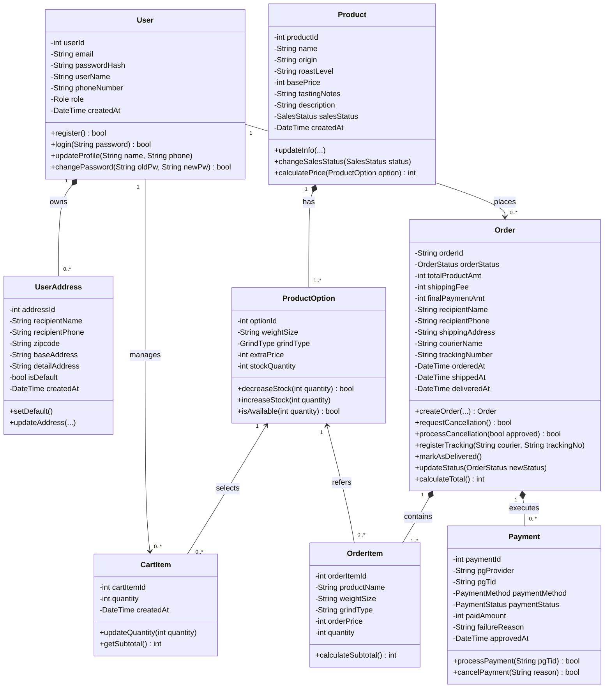

# 4.1 Class Diagram

## 1. Overview

This document specifies the UML Class Diagram for the back-end system of the **Coffee Bean Shopping Mall System** (`<Coffee Bean Shopping Mall System>`), addressing SRS Section 4.1.

The domain architecture directly maps to the relational schema defined in [backend/schema.sql](../../backend/schema.sql) and the user interactions defined in the front-end use case diagram [docs/frontend/usecase-diagram.drawio.svg](../frontend/usecase-diagram.drawio.svg).

---

## 2. Enumerations (Domain Types)

| Enum Name | Values | Description |
|-----------|--------|-------------|
| `Role` | `MEMBER`, `ADMIN` | User access privilege levels |
| `SalesStatus` | `ON_SALE`, `SOLD_OUT`, `STOPPED` | Product sales availability |
| `GrindType` | `WHOLE_BEAN`, `HAND_DRIP`, `ESPRESSO` | Coffee bean grind options |
| `OrderStatus` | `PENDING`, `PAID`, `PREPARING`, `SHIPPED`, `DELIVERED`, `CANCEL_REQUESTED`, `CANCELLED` | Order lifecycle states including delivery and cancellation |
| `PaymentStatus` | `READY`, `SUCCESS`, `FAILED`, `CANCELLED` | Payment transaction lifecycle |
| `PaymentMethod` | `CARD`, `EASY_PAY`, `TRANSFER` | Supported payment providers/methods |

---

## 3. Traceability Matrix

| Use Case (from `usecase-diagram.drawio.svg`) | Actor | Primary Class | Back-end DB Table |
|---------------------------------------------|-------|---------------|-------------------|
| Log In, Sign Up, Manage Account | Guest / Member | `User`, `UserAddress` | `users`, `user_addresses` |
| Browse Coffee Beans, Filter, View Details | Guest / Member | `Product`, `ProductOption` | `products`, `product_options` |
| Manage Cart (Add, View, Change, Remove) | Customer (Guest / Member) | `CartItem` | `cart_items` |
| Place Order, Review Order | Member | `Order`, `OrderItem` | `orders`, `order_items` |
| Make Payment, Retry Payment | Member / PG | `Payment` | `payments` |
| Manage My Orders, Track Delivery, Cancel Order | Member | `Order` | `orders` |
| Manage Products (Register, Stock, Status) | Administrator | `Product`, `ProductOption` | `products`, `product_options` |
| Manage Orders (View, Prepare Shipment, Update Delivery Status) | Administrator | `Order` | `orders` |
| Process Cancellation | Administrator | `Order`, `Payment` | `orders`, `payments` |
