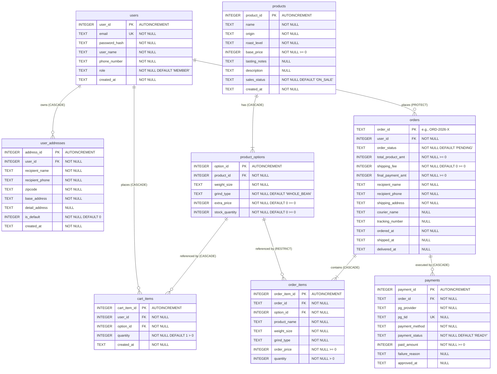

# Database Schema & Table Specification

## 1. Overview

This document specifies the relational database schema and table specifications for the back-end system of the **Coffee Bean Shopping Mall System** (`<Coffee Bean Shopping Mall System>`), addressing the **Database schema and table specification** deliverable in `docs/deliverables.md`.

The physical database is designed for **SQLite 3** (`PRAGMA foreign_keys = ON;`) and strictly maps to the back-end domain models in `backend/orders/models.py`, `backend/products/models.py`, and `backend/users/models.py`.

### 1.1 Key Architecture Decisions
1. **Consolidated Order & Fulfillment**: Single-destination shipment attributes (`courier_name`, `tracking_number`, `shipped_at`, `delivered_at`) are integrated directly into the `orders` table. This eliminates redundant 1:1 join overhead, avoids out-of-sync state duplicates between order and delivery lifecycles, and resolves the issue of creating pending delivery records prior to courier dispatch.
2. **Multi-Payment Support for Retries (`0..*`)**: The `payments` table maintains an `N:1` foreign key relation to `orders`, accommodating failed payment attempts and subsequent retry transactions under the same order instance.
3. **Audit Snapshotting**: `order_items` stores frozen snapshots of product attributes (`product_name`, `weight_size`, `grind_type`, `order_price`) at the moment of checkout, ensuring historical orders remain immutable regardless of catalog modifications.
4. **Data Protection on User Removal**: `orders.user_id` enforces a non-cascading foreign key (`RESTRICT` / `PROTECT`) to preserve transaction, accounting, and taxation records even if a user account is deactivated or deleted.

---

## 2. Entity-Relationship Diagram (ERD)



---

## 3. Table Specifications

### 3.1 `users` (User Master)
- **Description**: Stores credentials, contact details, and role privileges for all registered members and administrators.

| Column Name | Data Type | Nullable | Key | Default Value | Constraints | Description |
|-------------|-----------|----------|-----|---------------|-------------|-------------|
| `user_id` | `INTEGER` | `NO` | `PK` | `AUTOINCREMENT` | Primary Key | Unique user surrogate identifier |
| `email` | `TEXT` | `NO` | `UK` | None | Unique login email | User login identifier and contact email |
| `password_hash` | `TEXT` | `NO` | None | None | None | Securely hashed password (e.g. PBKDF2/Argon2) |
| `user_name` | `TEXT` | `NO` | None | None | None | Full legal or display name of the customer |
| `phone_number` | `TEXT` | `NO` | None | None | None | Contact phone/mobile number |
| `role` | `TEXT` | `NO` | None | `'MEMBER'` | `CHECK(role IN ('MEMBER', 'ADMIN'))` | Authorization role level |
| `created_at` | `TEXT` | `NO` | None | `DATETIME('now', 'localtime')` | ISO-8601 string | Account registration timestamp |

---

### 3.2 `user_addresses` (Shipping Destinations)
- **Description**: Stores delivery destinations registered by members for reuse during checkout.

| Column Name | Data Type | Nullable | Key | Default Value | Constraints | Description |
|-------------|-----------|----------|-----|---------------|-------------|-------------|
| `address_id` | `INTEGER` | `NO` | `PK` | `AUTOINCREMENT` | Primary Key | Address surrogate identifier |
| `user_id` | `INTEGER` | `NO` | `FK` | None | `REFERENCES users(user_id) ON DELETE CASCADE` | Associated member identifier |
| `recipient_name` | `TEXT` | `NO` | None | None | None | Recipient person name |
| `recipient_phone`| `TEXT` | `NO` | None | None | None | Recipient contact phone number |
| `zipcode` | `TEXT` | `NO` | None | None | None | 5-digit postal code |
| `base_address` | `TEXT` | `NO` | None | None | None | Road/street address |
| `detail_address` | `TEXT` | `YES` | None | `NULL` | None | Specific unit, room, or building detail |
| `is_default` | `INTEGER` | `NO` | None | `0` | `CHECK(is_default IN (0, 1))` | Boolean indicator for default shipping destination |
| `created_at` | `TEXT` | `NO` | None | `DATETIME('now', 'localtime')` | ISO-8601 string | Address registration timestamp |

---

### 3.3 `products` (Coffee Bean Master)
- **Description**: Master catalog for roasted whole bean coffee products offered in the shopping mall.

| Column Name | Data Type | Nullable | Key | Default Value | Constraints | Description |
|-------------|-----------|----------|-----|---------------|-------------|-------------|
| `product_id` | `INTEGER` | `NO` | `PK` | `AUTOINCREMENT` | Primary Key | Product master identifier |
| `name` | `TEXT` | `NO` | None | None | None | Name of the coffee bean (e.g., 'Ethiopia Yirgacheffe G1') |
| `origin` | `TEXT` | `NO` | None | None | None | Country / region of cultivation |
| `roast_level` | `TEXT` | `NO` | None | None | None | Roasting degree (Light, Medium, Dark) |
| `base_price` | `INTEGER` | `NO` | None | None | `CHECK(base_price >= 0)` | Base unit price in KRW |
| `tasting_notes` | `TEXT` | `YES` | None | `NULL` | None | Sensory flavor notes (e.g., Floral, Citrus, Berry) |
| `description` | `TEXT` | `YES` | None | `NULL` | None | Detailed promotional/origin narrative |
| `sales_status` | `TEXT` | `NO` | None | `'ON_SALE'` | `CHECK(sales_status IN ('ON_SALE', 'SOLD_OUT', 'STOPPED'))` | Current commercial availability status |
| `created_at` | `TEXT` | `NO` | None | `DATETIME('now', 'localtime')` | ISO-8601 string | Product listing timestamp |

---

### 3.4 `product_options` (Variant SKU & Inventory)
- **Description**: Specific sellable variants categorized by packaging weight and grind type, tracking live inventory.

| Column Name | Data Type | Nullable | Key | Default Value | Constraints | Description |
|-------------|-----------|----------|-----|---------------|-------------|-------------|
| `option_id` | `INTEGER` | `NO` | `PK` | `AUTOINCREMENT` | Primary Key | Option SKU identifier |
| `product_id` | `INTEGER` | `NO` | `FK` | None | `REFERENCES products(product_id) ON DELETE CASCADE` | Associated product master |
| `weight_size` | `TEXT` | `NO` | `UK (composite)` | None | e.g. `'200g'`, `'500g'`, `'1kg'` | Package weight size |
| `grind_type` | `TEXT` | `NO` | `UK (composite)` | `'WHOLE_BEAN'` | e.g. `'WHOLE_BEAN'`, `'HAND_DRIP'`, `'ESPRESSO'` | Grind coarseness specification |
| `extra_price` | `INTEGER` | `NO` | None | `0` | `CHECK(extra_price >= 0)` | Surcharge added to product `base_price` in KRW |
| `stock_quantity` | `INTEGER`| `NO` | None | `0` | `CHECK(stock_quantity >= 0)` | Current available physical inventory count |

- **Composite Unique Constraint**: `UNIQUE (product_id, weight_size, grind_type)` ensures duplicate variant SKUs cannot be defined under the same master product.

---

### 3.5 `cart_items` (Shopping Cart Staging)
- **Description**: Temporary items staged by users before creating a formal purchase order.

| Column Name | Data Type | Nullable | Key | Default Value | Constraints | Description |
|-------------|-----------|----------|-----|---------------|-------------|-------------|
| `cart_item_id` | `INTEGER` | `NO` | `PK` | `AUTOINCREMENT` | Primary Key | Cart line item identifier |
| `user_id` | `INTEGER` | `NO` | `FK` | None | `REFERENCES users(user_id) ON DELETE CASCADE` | Owner user identifier |
| `option_id` | `INTEGER` | `NO` | `FK` | None | `REFERENCES product_options(option_id) ON DELETE CASCADE` | Selected variant SKU |
| `quantity` | `INTEGER` | `NO` | None | `1` | `CHECK(quantity > 0)` | Selected item purchase quantity |
| `created_at` | `TEXT` | `NO` | None | `DATETIME('now', 'localtime')` | ISO-8601 string | Timestamp when item was staged |

- **Composite Unique Constraint**: `UNIQUE (user_id, option_id)` prevents duplicate rows for the same SKU in a single user's cart; quantities are updated instead.

---

### 3.6 `orders` (Order Master & Fulfillment)
- **Description**: Core commercial transaction record capturing payment totals, delivery destination, current lifecycle state, and shipping dispatch tracking.

| Column Name | Data Type | Nullable | Key | Default Value | Constraints | Description |
|-------------|-----------|----------|-----|---------------|-------------|-------------|
| `order_id` | `TEXT` | `NO` | `PK` | None | Primary Key (e.g. `'ORD-2026-X'`) | Unique business order identifier |
| `user_id` | `INTEGER` | `NO` | `FK` | None | `REFERENCES users(user_id)` (RESTRICT / PROTECT) | Purchasing customer identifier |
| `order_status` | `TEXT` | `NO` | None | `'PENDING'` | `CHECK(order_status IN ('PENDING', 'PAID', 'PREPARING', 'SHIPPED', 'DELIVERED', 'CANCEL_REQUESTED', 'CANCELLED'))` | Current lifecycle state of the order |
| `total_product_amt`| `INTEGER` | `NO` | None | None | `CHECK(total_product_amt >= 0)` | Sum of all ordered line item subtotals in KRW |
| `shipping_fee` | `INTEGER` | `NO` | None | `0` | `CHECK(shipping_fee >= 0)` | Calculated shipping charge in KRW |
| `final_payment_amt`| `INTEGER` | `NO` | None | None | `CHECK(final_payment_amt >= 0)` | Net payable charge (`total_product_amt + shipping_fee`) |
| `recipient_name` | `TEXT` | `NO` | None | None | None | Snapshot recipient name for this shipment |
| `recipient_phone`| `TEXT` | `NO` | None | None | None | Snapshot recipient telephone number |
| `shipping_address`| `TEXT` | `NO` | None | None | None | Snapshot full shipping destination address |
| `courier_name` | `TEXT` | `YES` | None | `NULL` | None | Logistics/courier partner name (set upon shipment) |
| `tracking_number`| `TEXT` | `YES` | None | `NULL` | None | Carrier tracking/waybill number |
| `ordered_at` | `TEXT` | `NO` | None | `DATETIME('now', 'localtime')` | ISO-8601 string | Order placement timestamp |
| `shipped_at` | `TEXT` | `YES` | None | `NULL` | ISO-8601 string | Courier dispatch timestamp |
| `delivered_at` | `TEXT` | `YES` | None | `NULL` | ISO-8601 string | Confirmed delivery completion timestamp |

---

### 3.7 `order_items` (Order Item Snapshots)
- **Description**: Frozen line item records for each product purchased in an order. Captures name and price snapshots to safeguard historical audit integrity.

| Column Name | Data Type | Nullable | Key | Default Value | Constraints | Description |
|-------------|-----------|----------|-----|---------------|-------------|-------------|
| `order_item_id`| `INTEGER` | `NO` | `PK` | `AUTOINCREMENT` | Primary Key | Order line item surrogate identifier |
| `order_id` | `TEXT` | `NO` | `FK` | None | `REFERENCES orders(order_id) ON DELETE CASCADE` | Parent order identifier |
| `option_id` | `INTEGER` | `NO` | `FK` | None | `REFERENCES product_options(option_id)` | Referenced variant option identifier |
| `product_name` | `TEXT` | `NO` | None | None | None | Snapshot product name at time of purchase |
| `weight_size` | `TEXT` | `NO` | None | None | None | Snapshot packaging size at purchase |
| `grind_type` | `TEXT` | `NO` | None | None | None | Snapshot grind setting at purchase |
| `order_price` | `INTEGER` | `NO` | None | None | `CHECK(order_price >= 0)` | Snapshot unit price at purchase in KRW |
| `quantity` | `INTEGER` | `NO` | None | None | `CHECK(quantity > 0)` | Number of units purchased |

---

### 3.8 `payments` (Payment Transactions)
- **Description**: Payment authorization records generated via Payment Gateway (PG) integration, supporting retries and cancellation/refunds.

| Column Name | Data Type | Nullable | Key | Default Value | Constraints | Description |
|-------------|-----------|----------|-----|---------------|-------------|-------------|
| `payment_id` | `INTEGER` | `NO` | `PK` | `AUTOINCREMENT` | Primary Key | Payment transaction record identifier |
| `order_id` | `TEXT` | `NO` | `FK` | None | `REFERENCES orders(order_id)` | Associated order identifier (allows 1:N for retries) |
| `pg_provider` | `TEXT` | `NO` | None | None | e.g. `'TOSS'`, `'INICIS'`, `'NAVERPAY'` | Payment Gateway operator |
| `pg_tid` | `TEXT` | `YES` | `UK` | `NULL` | Unique transaction ID from PG | Gateway transaction/authorization identifier |
| `payment_method` | `TEXT` | `NO` | None | None | `'CARD'`, `'EASY_PAY'`, `'TRANSFER'` | Payment instrument method |
| `payment_status` | `TEXT` | `NO` | None | `'READY'` | `CHECK(payment_status IN ('READY', 'SUCCESS', 'FAILED', 'CANCELLED'))` | Gateway transaction lifecycle state |
| `paid_amount` | `INTEGER` | `NO` | None | None | `CHECK(paid_amount >= 0)` | Actual charged transaction amount in KRW |
| `failure_reason`| `TEXT` | `YES` | None | `NULL` | None | Diagnostic error message if payment was rejected |
| `approved_at` | `TEXT` | `YES` | None | `NULL` | ISO-8601 string | Gateway authorization approval timestamp |

---

## 4. Performance Indexes

The following physical indexes are created in `backend/schema.sql` to optimize query execution and search filtering:

| Index Name | Target Table | Indexed Columns | Justification / Target Queries |
|------------|--------------|-----------------|--------------------------------|
| `idx_products_name` | `products` | `(name)` | Accelerates user product search by keyword/name |
| `idx_products_filter` | `products` | `(origin, roast_level, base_price)` | Optimizes multi-facet catalog filtering on browse pages |
| `idx_user_addresses_user_id` | `user_addresses` | `(user_id)` | Speeds up retrieval of saved addresses during checkout |
| `idx_cart_items_user_id` | `cart_items` | `(user_id)` | Speeds up cart display queries for logged-in users |
| `idx_orders_user_id` | `orders` | `(user_id)` | Accelerates "My Orders" order history retrieval |
| `idx_orders_status_ordered_at` | `orders` | `(order_status, ordered_at DESC)` | Optimizes administrator order management filtered by state and date |
| `idx_orders_tracking` | `orders` | `(tracking_number)` | Enables immediate lookup by carrier shipment tracking number |
| `idx_order_items_order_id` | `order_items` | `(order_id)` | Speeds up loading line items for order detail pages |
| `idx_payments_order_id` | `payments` | `(order_id)` | Speeds up lookup of payment attempts and transaction history for an order |

---

## 5. Domain Lifecycle & State Machine Rules

### 5.1 Order Lifecycle (`order_status`)
```
[PENDING] ----------> [CANCELLED]
   │ (Payment done)       ▲
   ▼                      │
 [PAID]                   │ (Admin approves cancellation)
   │                      │
   ▼                      │
[PREPARING] ──> [CANCEL_REQUESTED]
   │
   ▼ (Tracking registered)
[SHIPPED]
   │
   ▼ (Delivery completed)
[DELIVERED]
```

- **`PENDING`**: Order created from cart items, awaiting payment transaction.
- **`PAID`**: Payment completed successfully via PG; stock successfully decremented.
- **`PREPARING`**: Merchant preparing coffee beans and packaging.
- **`SHIPPED`**: Courier and tracking number registered (`courier_name`, `tracking_number`, `shipped_at` populated).
- **`DELIVERED`**: Parcel delivered to recipient (`delivered_at` populated).
- **`CANCEL_REQUESTED`**: Member requested cancellation while order was in `PAID` or `PREPARING` status.
- **`CANCELLED`**: Order cancelled and voided. If previously paid, PG refund is processed and inventory is replenished.

### 5.2 Payment Lifecycle (`payment_status`)
- **`READY`**: Payment initialized and awaiting PG approval callback.
- **`SUCCESS`**: Authorized and confirmed by PG; advances parent order to `PAID`.
- **`FAILED`**: PG authorization declined (records `failure_reason`); customer may initiate a new payment attempt (`Retry Payment`).
- **`CANCELLED`**: Transaction refunded/voided upon order cancellation.
